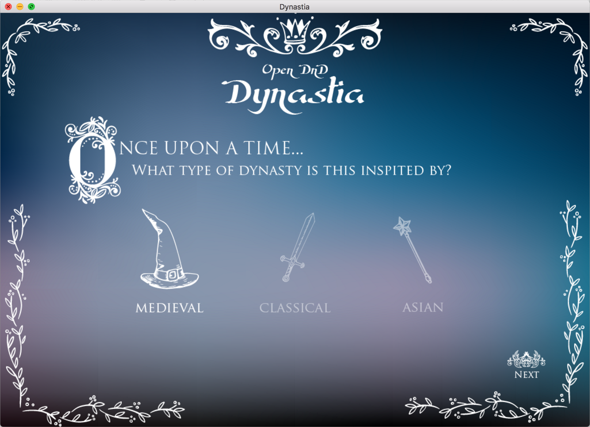

# Dynastia

[](https://nodei.co/npm/dynastia/) 

[](https://travis-ci.org/opendnd/dynastia) [](https://gitter.im/opendnd/dynastia?utm_source=badge&utm_medium=badge&utm_campaign=pr-badge&utm_content=badge)

This is a tool for D&D DM's to generate dynasties quickly when making a kingdom's history.


## Installation

You will need [node](https://nodejs.org/en/) and [npm](https://www.npmjs.com/) installed. Then do:

`npm install -g dynastia`

## Loading saved files

Once you have saved a file you can load it again.

`dynastia -i my-file.dyn`

## Web Server for saved files

Once you have saved a file you can load it into a server to view from your browser with the `-s` option. The default port is __8090__ but this can be changed with the DYNASTIA_PORT environment variable.

```
dynastia -si my-file.dyn
Dynastia server running: http://localhost:8090

DYNASTIA_PORT=80 dynastia -si my-file.dyn
Dynastia server running: http://localhost:80
```

## Changing the output directory

You can specify a specific output directory, otherwise it will save to `pwd`.

`dynastia -o my/output/dir`

## GUI

There is a GUI available on Mac and Windows systems that is [available for download](http://opendnd.org). This will receive updates overtime, but the CLI will continue to be the first place to receive the latest features.



## Contributing

Please read our [contributing guide](https://github.com/opendnd/dynastia/blob/master/CONTRIBUTING.md) for more information on contributing to the project.

## License

[MIT](https://github.com/opendnd/dynastia/blob/master/LICENSE)